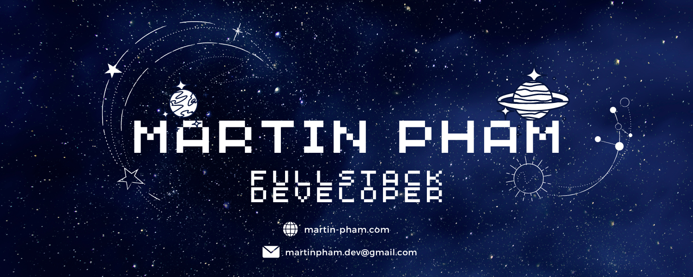

# 

### Hi there! 👋

I am a Full-Stack Developer with a passion for combining creativity with functionality. My goal in every project is to create a meaningful and engaging user-experience for all!

Currently learning Data Structures & Algorithms. The goal is to improve the quality of my code by taking into consideration space and time complexity to ensure my applications can run as efficiently as possible. I hope to improve my problem solving skills through learning algorithms, which will shape the way I think and how I approach new problems. 

Fun Fact: Aside from coding, my two favourite things are food and travel! You will see that most of my post-graduate projects will be centered around these two 😁

### Languages, Libraries, and Tools:

